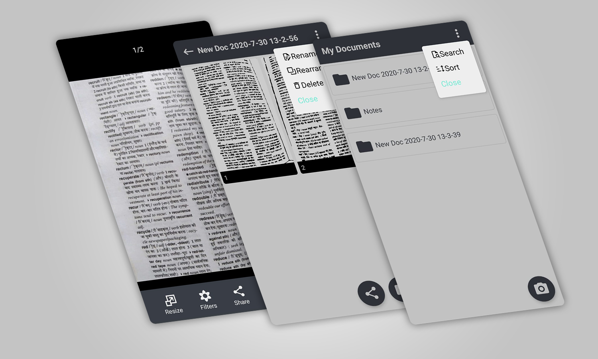

# Scanera - Document Scanner App
 React Native app to scan and organize documents
## To do
* Perspective transformation crop using OpenCV
* Add more filters

## Built With
* React Native
* OpenCV

## Screenshots

## Installation 
* Clone the repo.
* Download OpenCV 4.1.0 Android SDK
* Copy contents of `OpenCV-android-sdk/sdk/native/libs` to `android/app/src/main/jniLibs`
* `npm i`
* `npx react-native run-android`

## Acknowledgements 
* `react-native-fs`
* `react-native-camera`
* `react-native-image-zoom-viewer`
* `react-native-vector-icons`
* `react-navigation`
